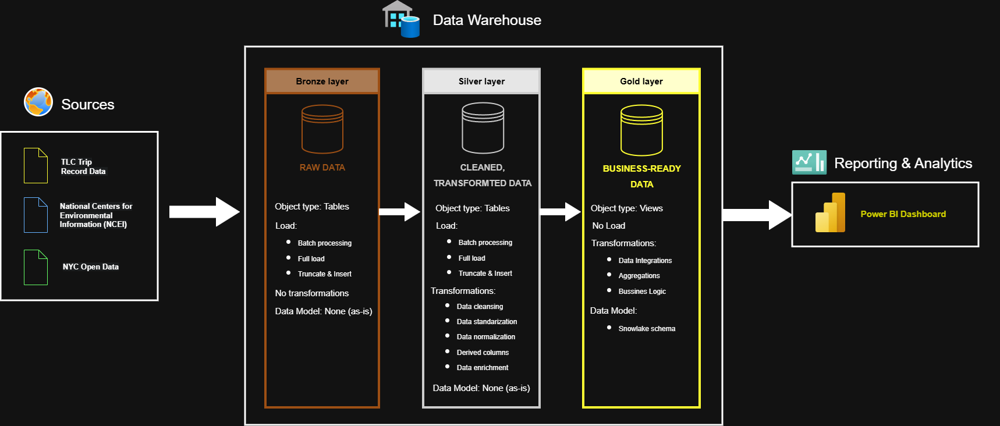

## 🚕 Project Overview

This project is an end-to-end **data warehouse focused primarily on New York City taxi trip data**, designed to simulate a real-world data engineering solution. The main goal was to practice and deepen understanding of **data engineering concepts**, including ETL processes, SQL-based transformations (procedures, functions, indexing), and layered data architecture.

The core dataset consists of **NYC taxi trips** (Yellow, Green, and For-Hire Vehicles), which is enriched with **weather data from Central Park** and **city events and holidays**. These additional sources allow for more advanced analytical use cases, such as analyzing the impact of weather conditions and events on taxi demand and pricing.

Data is ingested in **batch mode** and processed using a **three-layer medallion architecture (Bronze, Silver, Gold)**, resulting in analytics-ready datasets optimized for reporting and exploration.

### 🏗️ High-Level Architecture

The architecture was designed to be **flexible and extensible**. Although the project currently covers historical data for the year **2024 only**, adding data for future years (e.g. 2025) would require minimal changes to the existing pipeline.

The final output of the project includes:
- a curated **data warehouse (Gold layer)** designed for analytical use cases,
- a **Power BI dashboard** primarily targeting data analysts, with the possibility of supporting business-oriented reporting through additional aggregations.

While this project is a learning-focused simulation, it was built to resemble a **production-like environment**, incorporating elements such as logging, SQL procedures, and basic data quality checks.
