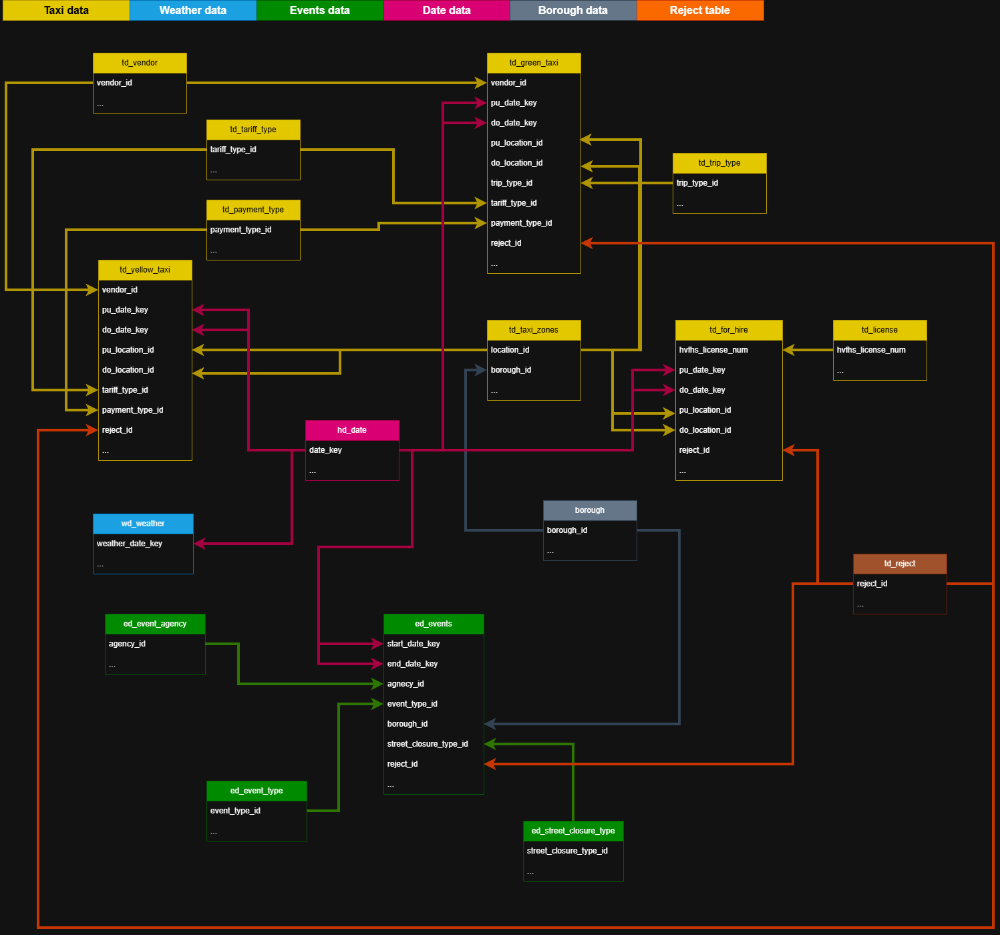
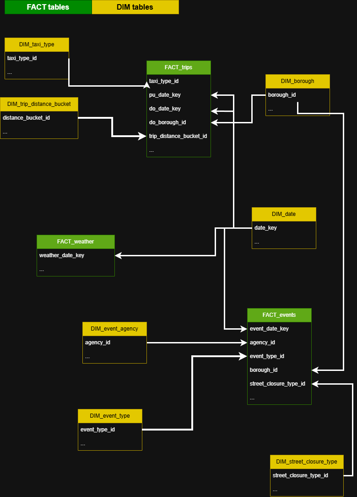

## 🚕 Project Overview

This project is an end-to-end **data warehouse focused primarily on New York City taxi trip data**, designed to simulate a real-world data engineering solution. The main goal was to practice and deepen understanding of **data engineering concepts**, including ETL processes, SQL-based transformations (procedures, functions, indexing), and layered data architecture.

The core dataset consists of **NYC taxi trips** (Yellow, Green, and For-Hire Vehicles), which is enriched with **weather data from Central Park** and **city events and holidays**. These additional sources allow for more advanced analytical use cases, such as analyzing the impact of weather conditions and events on taxi demand and pricing.

Data is ingested in **batch mode** and processed using a **three-layer medallion architecture (Bronze, Silver, Gold)**, resulting in analytics-ready datasets optimized for reporting and exploration.

### 🏗️ High-Level Architecture


The architecture was designed to be **flexible and extensible**. Although the project currently covers historical data for the year **2024 only**, adding data for future years (e.g. 2025) would require minimal changes to the existing pipeline.

The final output of the project includes:
- a curated **data warehouse (Gold layer)** designed for analytical use cases,
- a **Power BI dashboard** primarily targeting data analysts, with the possibility of supporting business-oriented reporting through additional aggregations.

While this project is a learning-focused simulation, it was built to resemble a **production-like environment**, incorporating elements such as logging, SQL procedures, and basic data quality checks.

---


## 🔍 Problem Statement & Use Cases

### 🧩 Problem Statement

Analyzing NYC taxi trips requires working with **large, raw, and fragmented datasets** that are difficult to use directly for analytical purposes. While detailed trip-level data is publicly available, it is not provided as a **single, clean, and analytics-ready data source**, nor is it easily extendable with additional contextual data.

From a **data analyst’s perspective**, there is a need for a curated dataset that:
- consolidates taxi trip data into a consistent schema,
- can be enriched with external data sources such as weather and city events,
- supports time-based, location-based, and demand-driven analysis.

This project addresses that gap by building a structured data warehouse that transforms raw data into a reliable analytical foundation.

---

### 📊 Key Analytical Use Cases
  
- **Demand & traffic patterns**: hourly, daily, borough-level trends
- **Pricing & trip analysis**: fare composition, averages, and distance-based metrics
- **Weather impact**: how temperature and precipitation affect trips and revenue
- **Events & holidays**: effect on taxi activity

---

### 🎯 Target User

- Data analysts exploring transportation patterns and trends in New York City  
- Analysts looking for a clean, extensible dataset for ad-hoc analysis and reporting

---

### 🔎 Scope of Analysis

- Historical, batch-processed data (year 2024)
- Descriptive and exploratory analytics
- No real-time processing or predictive modeling

---


## 📁 Repository Structure
```  
Data_warehouse_project_NYC_taxi/
│
├── docs                            # Documentation, data models, and architecture artifacts
│ ├── bronze                        # Data catalogs for the Bronze layer (raw datasets)
│ ├── silver                        # Data catalogs for the Silver layer (cleaned and conformed data)
│ ├── gold                          # Data catalogs for the Gold layer (analytics-ready data)
│ │
│ ├── naming_conventions.md         # Naming standards for schemas, tables, and columns
│ ├── Architecture_overview.png     # High-level data warehouse architecture diagram
│ ├── Data_model_silver.png         # Logical data model for the Silver layer
│ └── Data_model_gold.png           # Analytical data model for the Gold layer
│
├── scripts                         # SQL scripts for data ingestion and transformations
│ ├── bronze                        # Scripts for extracting and loading raw source data
│ ├── silver                        # Scripts for cleaning, standardizing, and integrating data
│ └── gold                          # Scripts for aggregations and analytical tables
│
└── README.md                       # Project overview, architecture, and documentation
```

---


## 🟫 Bronze Layer – Raw Data

- Stores raw datasets from NYC TLC, weather stations, and city events/holidays
- Data ingested via BULK INSERT in SQL Server, batch mode
- No business or analytical transformations are applied.
- No data cleansing, deduplication, or filtering is performed.
- Data is stored **as-is**, preserving the original source values.

The Bronze layer acts as a **raw and immutable landing zone**.

---


## ⬜ Silver Layer – Clean & Conformed Data

The Silver layer contains **cleaned and standardized data** from the Bronze layer.  

Key transformations performed in Silver:
- Standardization of column types (e.g., dates, numeric types)  
- Deduplication of records  
- Removal of nulls and obviously erroneous values  
- Unit conversions (e.g., miles → kilometers)  

Each table is validated using predefined conditions.  
Sample checks include:

| table_name | condition | error_id | error_message |
|------------|-----------|----------|---------------|
| td_yellow_taxi | pu_datetime >= do_datetime | 101 | VALUES WITH pu_datetime >= do_datetime |
| td_yellow_taxi | passenger_cnt > 9 | 102 | VALUES > 9 IN COLUMN passenger_cnt |
|
| ... | ... | ... | ... |

> ⚠️ Full quality check table includes all taxi types and event tables.

- The Silver layer uses **fact and dimension tables** to organize cleaned data  
- Prepares data for analytics without performing business-level aggregations  
- Diagram of Silver layer data model:  

  

---


## 🟨 Gold Layer – Aggregated & Analytics-Ready Data

The Gold layer contains **analytics-ready datasets** derived from the Silver layer.  
It includes:

- Aggregated data by **day, hour, borough, taxi type, and trip type**  
- Enriched data with **weather, events, and holidays**  
- Ready for **Power BI dashboards** and other analytical consumption  

This layer ensures the data is clean, consistent, and optimized for reporting, without including raw trip-level details.

- Gold layer uses **fact and dimension tables** optimized for analytical queries  
- Diagram of Gold layer data model:

  

---


## 📊 Power BI Dashboard

The project includes a **Power BI dashboard** built on the Gold layer, designed for data analysts to explore NYC taxi trips and their relationships with weather and city events.  


The dashboard is divided into **four main sections**:
- **Main Overview:** provides key performance indicators (KPIs) for an at-a-glance view of taxi activity.
- **Price Components"** page enables detailed fare analysis.
- **Weather Impact:** page shows relationships between weather conditions and taxi activity.
- **Events Impact:** page allows exploration of city events.


