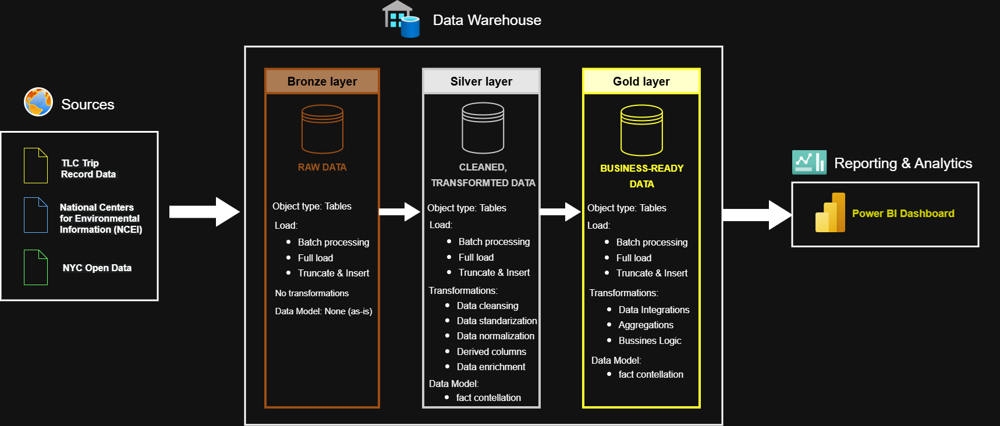
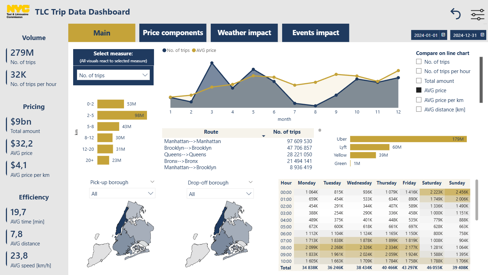

# 🚕 NYC Taxi Data Warehouse

This project is an **end-to-end batch-oriented data warehouse** built on NYC taxi trip data, enriched with **weather data** and **city events**. It demonstrates a **production-like data engineering solution** with a focus on data quality, deterministic processing, and performance optimization.

The final output is a **Gold-layer warehouse** optimized for analytical consumption and a **Power BI dashboard**.

---

## 🔍 Problem & Motivation

Raw NYC taxi data is **fragmented and inconsistent**, making direct analysis difficult. Challenges include:

- Different schemas across taxi types
- Limited data quality guarantees
- No unified analytical layer
- Hard enrichment with external datasets

This project solves these by:

- Consolidating multiple sources into a unified model
- Enforcing data quality and referential integrity
- Supporting safe enrichment with weather and events
- Providing a stable, analytics-ready foundation for BI

---

## 🏗️ Architecture

The warehouse follows a **three-layer medallion architecture**:



### 🥉 Bronze – Raw Data

- Stores raw datasets via **BULK INSERT** (SQL Server)
- **No transformations**; preserves lineage
- Landing zone for debugging and reprocessing

### 🥈 Silver – Cleaned & Conformed

- Data cleaning, standardization, and integration with weather/events
- Enforces **Primary/Foreign Keys** and indexes
- Tags invalid records with `reject_id` for traceability
- Preserves **per-trip granularity** for analytics

### 🥇 Gold – Aggregated & Analytics-Ready

- Aggregated datasets optimized for **Power BI dashboards**
- Uses **Clustered Columnstore Indexes** for fast analytical queries
- Batch-loaded, read-heavy layer with stable, high-performance tables

> The architecture is modular and can easily be extended to additional datasets or years.

---

## ⚙️ Design Decisions

### Layer Isolation

- Each layer is in a **separate schema** for clear responsibility and safe reprocessing.

### Indexing

| Layer  | Indexing Strategy                                                                 |
|--------|---------------------------------------------------------------------------------|
| Bronze | No indexes – optimized for high-throughput batch loads                           |
| Silver | Primary keys (clustered), non-clustered indexes on join/date keys, foreign keys |
| Gold   | Clustered Columnstore Indexes for fast analytical scans                           |

### Data Quality & Observability

- Stored procedures log dataset, timestamp, row count, and status
- Invalid records tagged with `reject_id` and mapped to documented rules
- Re-validation ensures correct assignment of rejects

### Idempotent Processing

- Silver and Gold use **`TRUNCATE + INSERT`** for deterministic results
- Enables easy reprocessing and recovery from upstream issues

---

## 🔧 Metrics & Tools

### Dataset Size & Load Times (2024)

| Layer  | Records       | Load Time (min) |
|--------|--------------|----------------|
| Bronze | 292,094,834  | 45.9           |
| Silver | 281,750,218  | 49.2           |
| Gold   | 11,433,159   | 4.3            |

### Tools

- **SQL Server** (SSMS, stored procedures, dynamic SQL)
- **Power BI** for dashboards
- Minimal Python for CSV conversion before ingestion

---

## 📊 Power BI Dashboard

- Built on **Gold layer**; supports filtering by time, location, taxi type, and trip attributes
- Interactive exploration of trips with weather and event context
- [Dashboard link](https://your-link-here) (~250 MB)



> Designed for data analysts, while Gold layer also supports business reporting.

---

## 📥 Data Sources

- **NYC Taxi Trips:** [NYC Open Data](https://www.nyc.gov/data)  
- **Weather Data:** Central Park Historical Weather [NCEI](https://www.ncei.noaa.gov/data/global-summary-of-the-day/doc/)  
- **City Events:** Public NYC events dataset [NYC Open Data](https://www.nyc.gov/data)  

---

## 📂 Repository Structure

```
Data_warehouse_project_NYC_taxi/
│
├── docs/                           # Project documentation and architecture
│   ├── Architecture_overview.png   # Architecture diagram
│   ├── Dashboard_screen.png        # Power BI dashboard screenshot
│   └── other-docs/                 # Additional docs (drawio files, data catalog, naming conventions)
│
├── scripts/                        # SQL scripts for ETL and transformations
│   ├── bronze/                      # Extract & load raw data
│   ├── silver/                      # Clean & conform data
│   └── gold/                        # Aggregate & prepare analytics tables
│
├── tests/                           # Test scripts and data quality checks
├── README.md                        # Project overview
```


